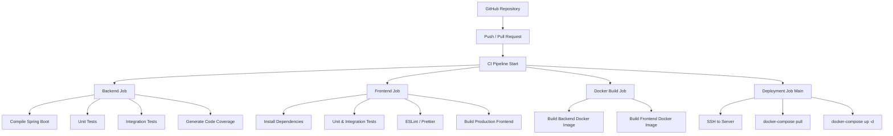
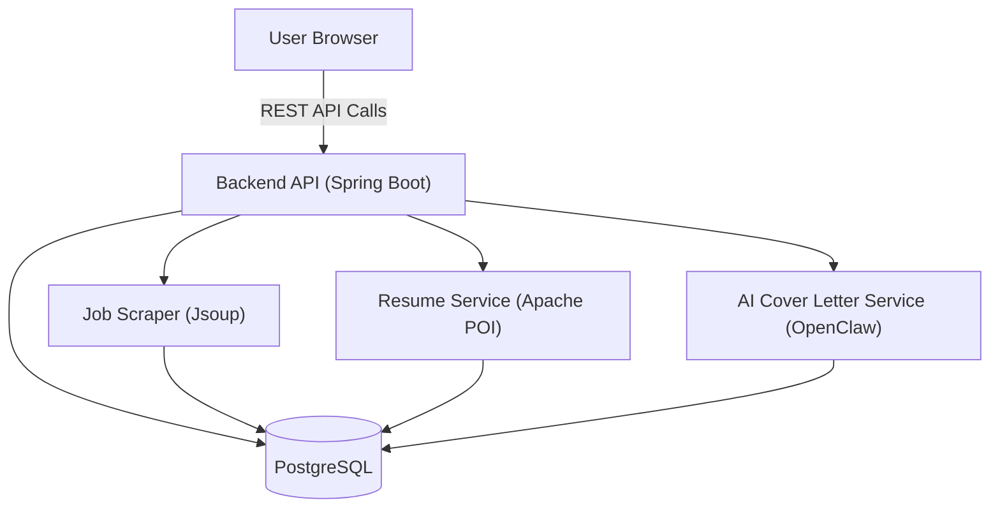

# Resume & Application Helper

**Automated job search and application management tool** built with **Java Spring Boot** backend and **React + TypeScript** frontend, containerized with **Docker Compose** and fully tested with professional CI/CD pipelines.

---

## Project Overview

The Resume & Application Helper project helps job seekers:

1. Scrape jobs from Cambodian websites (CamHR, BongThom, Khmer24, LinkedIn Cambodia)
2. Manage multiple resumes and auto-select the most relevant one
3. Generate tailored AI-powered cover letters using OpenAI API
4. Track job applications and their status
5. Send optional notifications via Telegram or Discord
6. Provide a user-friendly web interface for dashboard, resumes, letters, and application tracking

---

## Tech Stack

### Backend
- **Language:** Java 17+
- **Framework:** Spring Boot
- **Job Scraping:** Jsoup + HttpClient
- **Database:** PostgreSQL
- **Resume & Cover Letter:** Apache POI (Word), PDFBox (PDF)
- **AI Integration:** OpenAI REST API
- **Scheduler:** Spring `@Scheduled`
- **Notifications:** Telegram API, Discord webhook, JavaMail API
- **Testing:** JUnit 5 + Mockito, Spring Boot Test + Testcontainers
- **Code Coverage:** JaCoCo

### Frontend
- **Framework:** React + TypeScript
- **Styling:** TailwindCSS or Material-UI
- **HTTP Requests:** Axios
- **State Management:** React Context or Redux Toolkit
- **Document Preview:** PDF.js (optional)
- **Testing:** Jest + React Testing Library, Cypress/Playwright for E2E

### Dev & Deployment Tools
- Docker & Docker Compose
- GitHub Actions for CI/CD
- Git version control
- IDEs: IntelliJ IDEA, VS Code

---

## Monorepo Structure

```text
resume-helper/
├─ backend/           # Spring Boot project
│   ├─ src/
│   ├─ test/          # Unit + Integration Tests
│   ├─ pom.xml
│   └─ Dockerfile
├─ frontend/          # React + TypeScript
│   ├─ src/
│   ├─ test/          # Unit + Integration Tests
│   ├─ package.json
│   └─ Dockerfile
├─ docker-compose.yml
├─ .github/
│   └─ workflows/ci-cd.yml
├─ README.md
└─ .gitignore
```

---

### Docker Compose Setup

```yaml
version: "3.9"
services:
  backend:
    build: ./backend
    ports:
      - "8080:8080"
    environment:
      - SPRING_DATASOURCE_URL=jdbc:postgresql://db:5432/job_helper
      - SPRING_DATASOURCE_USERNAME=postgres
      - SPRING_DATASOURCE_PASSWORD=postgres
      - OPENAI_API_KEY=${OPENAI_API_KEY}
    depends_on:
      - db

  frontend:
    build: ./frontend
    ports:
      - "3000:3000"
    environment:
      - REACT_APP_API_URL=http://localhost:8080

  db:
    image: postgres:15
    environment:
      POSTGRES_USER: postgres
      POSTGRES_PASSWORD: postgres
      POSTGRES_DB: job_helper
    volumes:
      - pgdata:/var/lib/postgresql/data

volumes:
  pgdata:
```

---

### CI/CD Pipeline

## Pipeline Overview

This CI/CD pipeline validates your code on every push or PR, building, testing, and preparing Docker images for deployment.



---

### Testing Strategy

## Backend

- **Unit Tests**: services, controllers, scraping logic, AI integration (JUnit + Mockito)

- **Integration Tests**: database + REST API endpoints (Spring Boot Test + Testcontainers)

- **E2E Tests**: full workflow (scrape → store → generate letter → track applications)

- **Code Coverage**: target ≥ 70%

## Frontend

- **Unit Tests**: React components & utilities (Jest + React Testing Library)

- **Integration Tests**: Component trees and page workflows

- **E2E Tests**: simulate user interaction (Cypress / Playwright)

- **Code Coverage**: target ≥ 70%

---

### Development Roadmap

## Phase 1: Backend MVP

- Job scraper for 1 Cambodian site

- Resume manager (PDF/Word export)

- AI cover letter generation

- Application tracker endpoints

## Phase 2: Frontend Integration

- React SPA for job dashboard, resumes, cover letters, application tracker

- Connect frontend with backend REST API

## Phase 3: Advanced Features

- Multiple job sources

- Notifications via Telegram / Discord

- Scheduler for automatic scraping & AI tasks

- Full Dockerized deployment with CI/CD

---

### Architecture Diagram



---

### Best Practices

- Monorepo for simplicity
- Docker Compose for environment consistency
- Automated CI/CD with tests on every commit/PR
- Environment variables for API keys & DB credentials

---

## Getting Started

### Prerequisites
- Docker & Docker Compose
- Java 17 (for local backend development)
- Node.js 20 (for local frontend development)
- OpenAI API Key (for AI features)
- Discord Webhook URL (for notifications)

### Environment Setup
1. **Backend**: Create/edit `backend/src/main/resources/application.yaml`:
   ```yaml
   openclaw:
     api:
       key: your_openai_api_key
   discord:
     webhook:
       url: your_discord_webhook_url
   ```
2. **Docker**: Set environment variables in your shell or a `.env` file:
   ```env
   OPENCLAW_API_KEY=your_openai_api_key
   DISCORD_WEBHOOK_URL=your_discord_webhook_url
   ```

### Running the Project
```bash
docker-compose up --build
```
- Frontend: http://localhost:3000
- Backend: http://localhost:8080

---

### Outcome

By following this setup:

- Fully tested backend + frontend

- Automated CI/CD pipeline

- Dockerized environment ready for development and production

- Professional-grade structure and workflow suitable for a real workplace

- Portfolio-ready project that demonstrates real-world engineering practices